# Chrome Extension : youtube_time_stamp

By : [MD AZIZUL HAKIM ANTOR](https://www.linkedin.com/in/md-antor/)
 
email: md.antor1155@gmail.com

## An Extention to save timeStamp while watching a youtube video to later come back and start from same place with just a click on bookmark.
[manifest: v3]
 
 
<h1 align="center"> Instruction to add the extension : </h1>

[ note: this extension only works on Chrome browser : desktop version .// Clone to give feedback and push any update you like to contribute, different branch than "main" ]

* Clone the git repo to your machine. 

* Open Chrome browser.
* Click on Chrome extension icon.

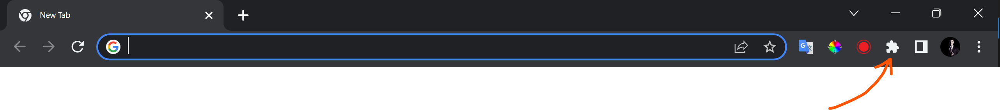

 
 

* click on Manage extension icon.

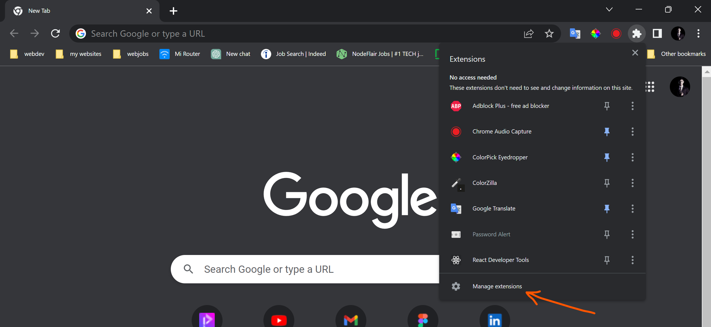

 
 
 

* Turn on Developer mode.

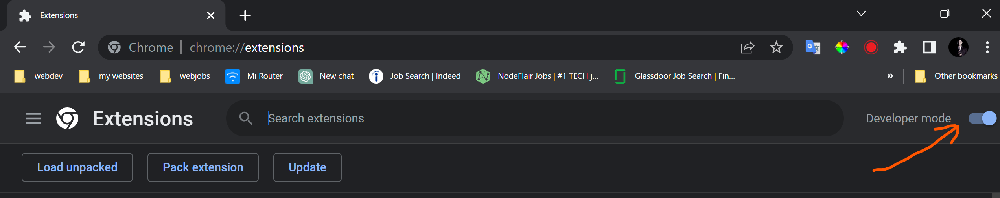

 
 
 

* Click load unpacked.

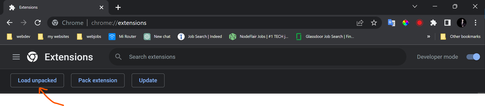

 
 
 

* In you system, select the directory containing manifest.json, assets and all other files inside it.
* Now you must see "YT time:video Bookmark by Antor 0.1.0" added to the extension grid.
 

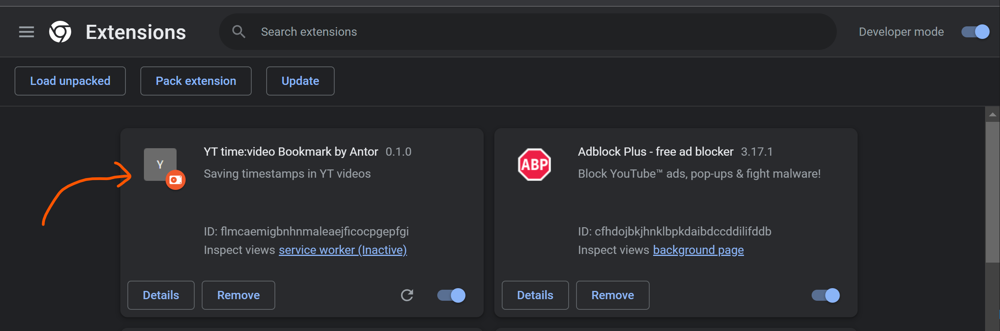

 
 
 

* Click on extension icon again.

 

* pin the extension to show on top and easy access.

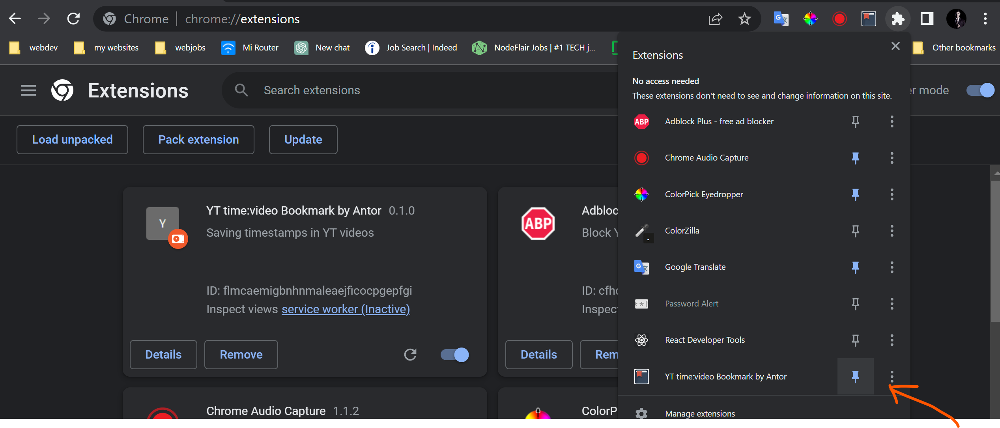

 
 
 
 

<h1 align="center">How does it Work ??!</h1>
<h2 align="center"> Easy to use </h2>

* Go to any Youtube video page

* You will see an add sign in Youtube video control panel.

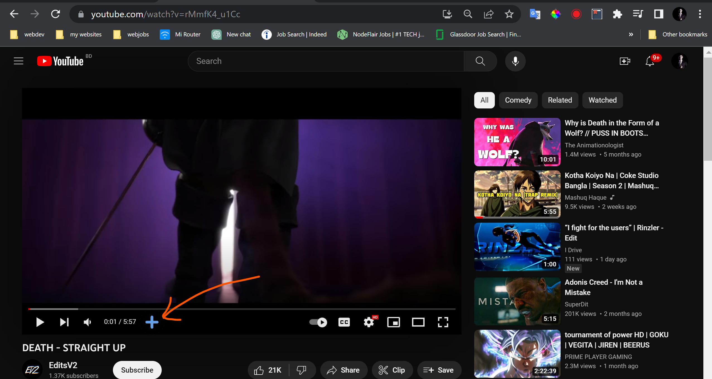

 
 

* Click the add sign to make a timestamp bookmark on the video at current time.

* Click on the "YT bookmark" extension icon to see all saved bookmark.

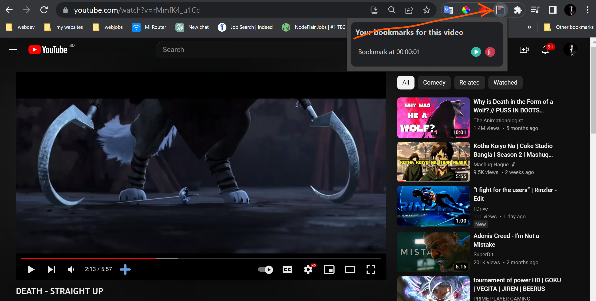

 
 

* Click play button on the bookmark to take the Youtube video to that particulat time.

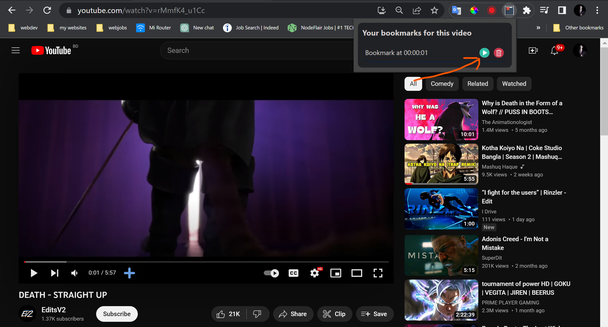

 
 

* Click on detele icon to delete the bookmark on current video.

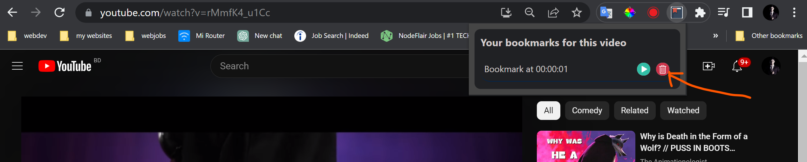

 
 

* If not on YouTube video play page, "YT bookmark" will show, " This is not a youtube video page"

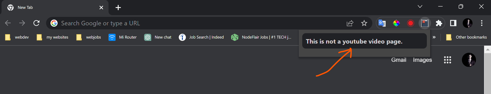

 
 

* can go to any other video and can have as many bookmarks as you want.

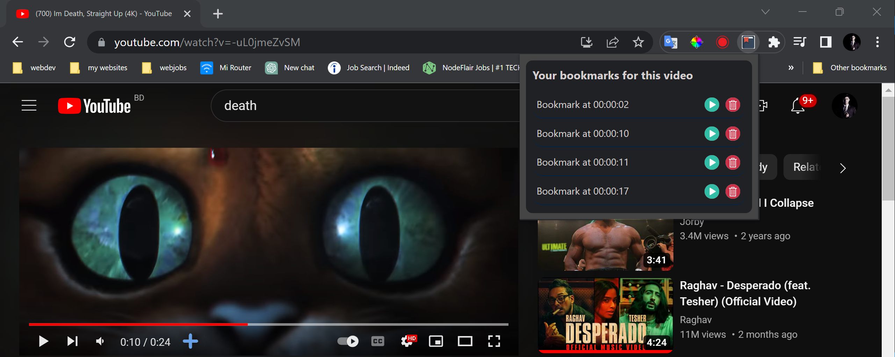

 
 
 
 
 

<h1 align="center">Extension will remember all your bookmarks</h1>
<h2 align="center">seperately for different videos; even after the browser is closed  or the system switched off</h2>

 
 
 

<h1 align="center">	&#128513; Enjoy and wish me best of luck !!! &#128151;</h1>